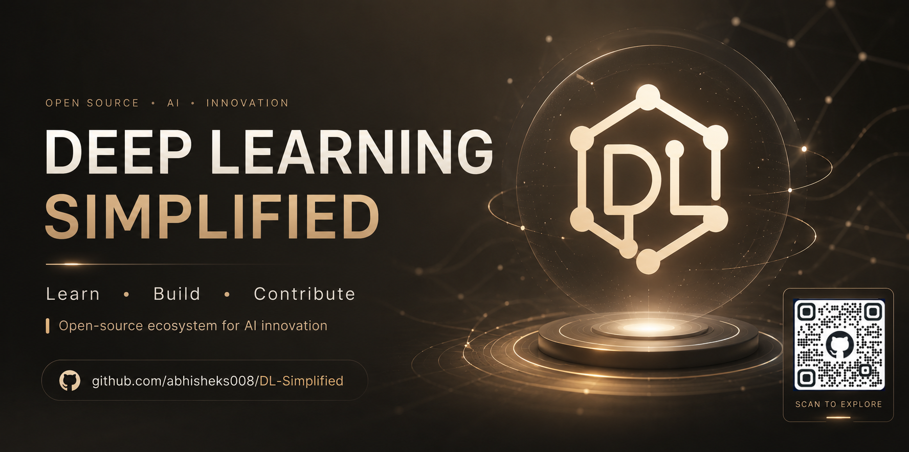

<p align="center">
  
</p>

<br>

<h1 align="center">
<br>
❈ DEEP LEARNING SIMPLIFIED  ❈<br>

</h1>

<p align="center">
  <i>
    Learn • Build • Contribute
  </i>
</p>

<p align="center">
  <sub>
    Open-source ecosystem for Deep Learning innovation
  </sub>
</p>

<br>

<p align="center">
  <a href="https://tinyurl.com/deep-learning-simplified">
    
  </a>
</p>

<br>

<p align="center">
  
  
  
  
</p>

---

<p >
  <i>
    Welcome to <b>Deep Learning Simplified</b> — a curated open-source ecosystem of Deep Learning projects crafted for contributors ranging from beginners to advanced practitioners.
  </i>
</p>

<p >
  Our aim is to simplify Deep Learning through practical implementations, collaborative learning, and hands-on open-source contributions.
</p>

<p >
  Whether you're exploring neural networks for the first time or building advanced AI systems, this repository provides a space to learn, innovate, and contribute. 🚀
</p>
<div align="center">


<br>


<br>


</div>

<br>
<div >

## ❈ Table of Contents ❈

</div>

- [Introduction](#deep-learning-simplified)
- [Welcome Contributors](#welcome-contributors)
- [Project Structure](#structure-of-the-projects)
- [Workflow](#workflow)
- [Open Source Programs](#open-source-programs)
- [New to Open Source](#new-to-open-source)
- [Achievements](#achievements)
- [Project Admin](#project-admin)
- [Top Contributors](#top-contributors)
- [Star This Project](#give-this-project-a-star)
- [Contact](#contact)

<div>

## ❈ Welcome Contributors 🔴 ❈

</div>
Deep learning is a subset of machine learning, which is essentially a neural network with three or more layers. These neural networks attempt to simulate the behavior of the human brain—albeit far from matching its ability—allowing it to “learn” from large amounts of data. Deep learning allows computational models that are composed of multiple processing layers to learn representations of data with multiple levels of abstraction. The concept of deep learning is not new. It has been around for a couple of years now. It’s in hype nowadays because earlier we did not have that much processing power and a lot of data. As in the last 20 years, the processing power increased exponentially, deep learning and machine learning came into the picture.

<br>

> **Deep Learning Simplified is an open-source repository containing beginner to advanced-level deep learning projects for contributors who are willing to start their journey in deep learning.**
<br>

<br>
<div>

## ❈ Structure of the Projects 📝 ❈

</div>
This repository consists of various machine learning projects, and all of the projects must follow a certain template. I want the contributors to keep this in mind while contributing to this repository.
<br>

✦ **Dataset**  
This folder stores the dataset used in this project. If the dataset cannot be uploaded to this folder due to its large size, then put a README.md file inside the Dataset folder and include the link to the collected dataset. That'll work!

✦ **Images**  
This folder is used to store the images generated during the data analysis, data visualization, and data segmentation of the project.

✦ **Model**  
This folder will contain your project file (that is .ipynb file) whether it's for analysis or prediction. In addition to the project file, it should also have a **'README.md'** using this [template](https://github.com/abhisheks008/DL-Simplified/blob/main/.github/readme_template.md) and **'requirements.txt'** file that includes all necessary add-ons and libraries for the project.

<br>

```
Project Folder
|- Dataset
   |- dataset.csv (dataset used for the particula project)
   |- README.md (brief about the dataset)
|- Images
   |- img1.png
   |- img2.png
   |- img3.png
|- Model
   |- project_folder.ipynb
   |- README.md
|- Web App (Only if you are implementing any GUI, optional one)
   |- templates
   |- static
   |- app.py
   |- demo.mp4
   |- README.md
|- requirements.txt
```

Please follow the [Code of Conduct](https://github.com/abhisheks008/DL-Simplified/blob/main/Code_of_conduct.md) and [Contributing Guidelines](https://github.com/abhisheks008/DL-Simplified/blob/main/CONTRIBUTING.md) while contributing in this project repository.

<br>
<div >

## ❈ Workflow 🧮 ❈

</div>

<br>

<div >

```text

🔍 Explore Repository

        ↓

📖 Read README

        ↓

🐛 Check Open Issues

        ↓

💬 Comment on Issue

        ↓

⏳ Wait for Assignment

        ↓

🍴 Fork Repository

        ↓

💻 Clone Repository

        ↓

🛠 Make Changes

        ↓

📌 Add • Commit • Push

        ↓

🚀 Create Pull Request

        ↓

🧑‍💻 Admin Reviews PR

        ↓

🎉 PR Gets Merged

```

</div>

<div>

<br>

<div >

## ❈ Open Source Programs ❄️ ❈

</div>

<br>

<table align="center" cellspacing="12">

<tr>

<td align="center">
<a href="https://ssoc.getsocialnow.co/#">

<br><br>
<sub><b>SSOC 2022</b></sub>
</a>
</td>

<td align="center">
<a href="https://hack2skill.com/hack/ssoc">

<br><br>
<sub><b>SSOC 2023</b></sub>
</a>
</td>

<td align="center">
<a href="https://swoc.getsocialnow.co/">

<br><br>
<sub><b>SWOC 2023</b></sub>
</a>
</td>

<td align="center">
<a href="https://www.codepeak.tech/">

<br><br>
<sub><b>CodePeak 2023</b></sub>
</a>
</td>

<td align="center">
<a href="https://swoc.getsocialnow.co/">

<br><br>
<sub><b>SWOC 2024</b></sub>
</a>
</td>

<td align="center">
<a href="https://gssoc.girlscript.tech/">

<br><br>
<sub><b>GSSoC 2024</b></sub>
</a>
</td>

<td align="center">
<a href="https://hacktoberfest.com/">

<br><br>
<sub><b>GSSoC Extd<br>AND<br>HacktoberFest 2024</b></sub>
</a>
</td>

</tr>

<tr><td colspan="7"><br></td></tr>

<tr>

<td align="center">
<a href="https://ieee-igdtuw.github.io/IEEE-IGDTUW-Official-Website/">

<br><br>
<sub><b>IEEE IGDTUW<br>Week of Code 2024</b></sub>
</a>
</td>

<td align="center">
<a href="https://kwoc.kossiitkgp.org/">

<br><br>
<sub><b>KWOC 2024</b></sub>
</a>
</td>

<td align="center">
<a href="https://www.socialwinterofcode.com/">

<br><br>
<sub><b>SWOC 2025</b></sub>
</a>
</td>

<td align="center">
<a href="https://winterofcode.tech/">

<br><br>
<sub><b>Winter of Code 4.0</b></sub>
</a>
</td>

<td align="center">
<a href="https://iwoc3.live/">

<br><br>
<sub><b>IWOC 2025</b></sub>
</a>
</td>

<td align="center">
<a href="https://www.jwoc.in/">

<br><br>
<sub><b>JWOC 2025</b></sub>
</a>
</td>

<td align="center">
<a href="https://codepeak.technology/">

<br><br>
<sub><b>CodePeak 2025</b></sub>
</a>
</td>

</tr>

<tr><td colspan="7"><br></td></tr>

<tr>

<td align="center">
<a href="https://dwoc.io/">

<br><br>
<sub><b>DWOC 2025</b></sub>
</a>
</td>

<td align="center">
<a href="">

<br><br>
<sub><b>GitRecQuest v1.0.0</b></sub>
</a>
</td>

</tr>

</table>

<br>
<div >

## ❈ New to Open Source Programs/Events 🤔 ❈

</div>

<br>

> Here are a few articles that will help you get an idea of how to start contributing to open source projects.  
> You can refer to the following articles on the basics of Git and GitHub.

<br>

<div >

| 🌟 Resource | 🔗 Access |
|:---|:---:|
| Watch this video to get started, if you have no clue about open source | [Click Here](https://youtu.be/SYtPC9tHYyQ) |
| Forking a Repo | [Click Here](https://help.github.com/en/github/getting-started-with-github/fork-a-repo) |
| Cloning a Repo | [Click Here](https://help.github.com/en/desktop/contributing-to-projects/creating-a-pull-request) |
| How to create a Pull Request | [Click Here](https://opensource.com/article/19/7/create-pull-request-github) |
| Getting started with Git and GitHub | [Click Here](https://towardsdatascience.com/getting-started-with-git-and-github-6fcd0f2d4ac6) |

</div>

<br><br>

<div >

## ❈ Achievements of this Project Repo 🏆 ❈

</div>

<br>

<div >

**1.🥇 Recognized as the "TOP PROJECT ADMIN" for Social Summer of Code, for the year 2022.**  


**2.🥇 Recognized as the "TOP PROJECT ADMIN" for Social Winter of Code, for the year 2023.**  


**3.🥇 Recognized as the "TOP PROJECT ADMIN" for Social Summer of Code, for the year 2023.**  


**4.🥇 Recognized as the "TOP PROJECT ADMIN" for GirlScript Summer of Code, for the year 2024.**  


**5.🥇 Recognized as the "TOP PROJECT ADMIN" for GirlScript Summer of Code Extended x HacktoberFest, for the year 2024.**

</div>

<br>

<div align="center">

## ❈ Project Admin ✔ ❈

</div>

<br>

<div align="center">

<a href="https://github.com/abhisheks008">
  
</a>

<br><br>

### ✦ Abhishek Sharma ✦

<p>
Maintainer • Creator • Open Source Project Admin
</p>

</div>

<br>

<div align="center">

## ❈ Top Contributors ✨ ❈

</div>

<br>

<div align="center">

> Thanks to these wonderful people! Contributions of any kind are welcome! 🚀

<br>

<!-- ALL-CONTRIBUTORS-LIST:START - Do not remove or modify this section -->
<!-- prettier-ignore-start -->
<!-- markdownlint-disable -->

<a href="https://github.com/abhisheks008/DL-Simplified/graphs/contributors">
  
</a>

<!-- markdownlint-enable -->
<!-- prettier-ignore-end -->
<!-- ALL-CONTRIBUTORS-LIST:END -->

</div>

<br><br>

<div align="center">

## ❈ Give this Project a Star ⭐ ❈

</div>

<br>

<div align="center">

<a href="https://github.com/abhisheks008/">

</a>
&nbsp;&nbsp;
<a href="https://twitter.com/abhishek_py3">

</a>

<br>If you liked working on this project, give it a ⭐ and share this repository.

** ✨ 🎊 😃 Happy Contributing 😃 🎊 ✨

</div>

<br><br>

<div align="center">

## ❈ Contact 📬 ❈

</div>

<br>

<div align="center">

> If you'd like to contact me, you can reach me through my social media handles.

<br>

<a href="https://twitter.com/abhishek_py3">
  
</a>
&nbsp;&nbsp;&nbsp;
<a href="https://www.linkedin.com/in/abhishek-sharma-aa06a9183/">
  
</a>
<br>

### ✦ © 2024 Abhishek Sharma ✦

<br>
<div align="center">
<a href="https://forthebadge.com">
  
</a>
&nbsp;&nbsp;
<a href="https://forthebadge.com">
  
</a>
&nbsp;&nbsp;
<a href="https://forthebadge.com">
  
</a>

</div>
<br>